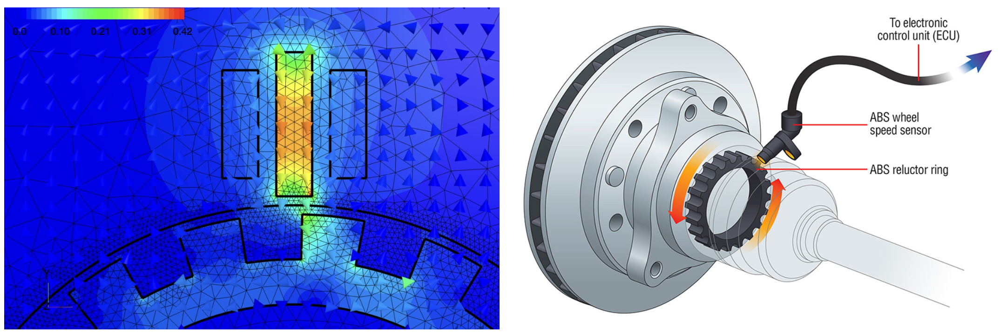
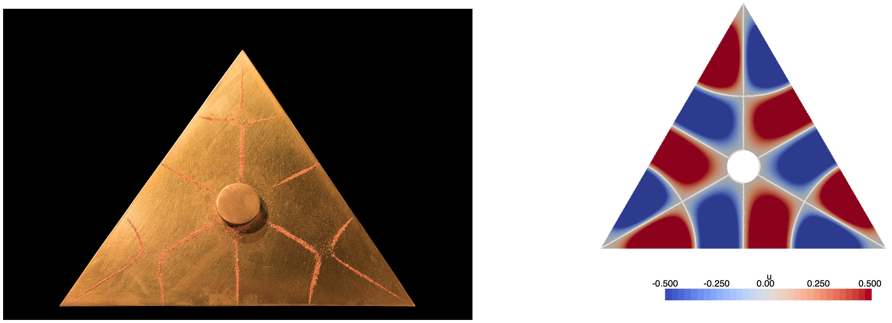
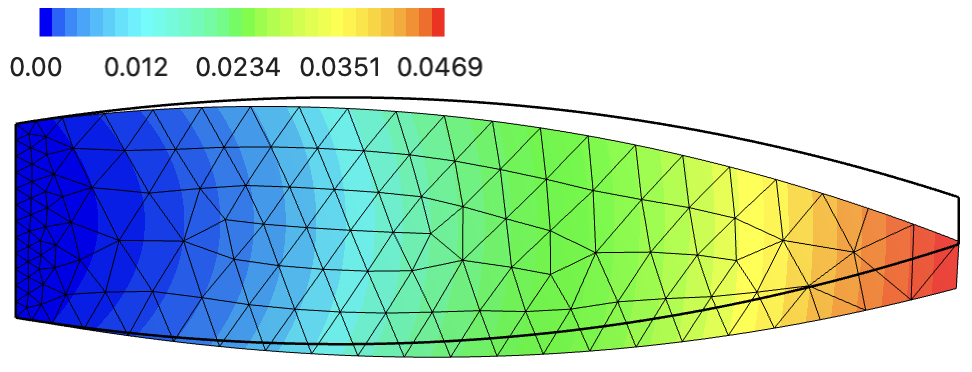
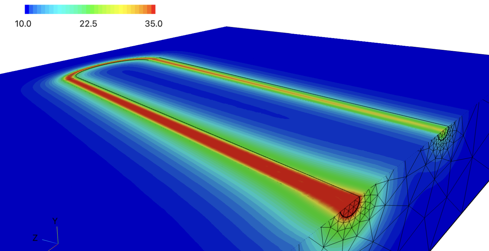
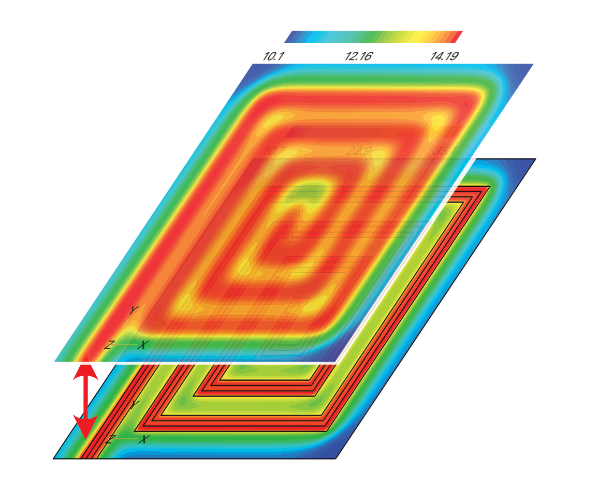

---
jupytext:
  formats: md:myst
  text_representation:
    extension: .md
    format_name: myst
    format_version: 0.12
    jupytext_version: 1.6.0
kernelspec:
  display_name: Python 3
  language: python
  name: python3
---

# Projects

The assessment is based on a project at the end of the semester.

::::{grid} auto
:gutter: 3

:::{grid-item-card} ABS Sensor
:class-header: bg-light

^^^

- Maxwell's equations in the 2d
- Rotating subdomain (hybrid interfaces)
- Sensor optimization

:::

:::{grid-item-card} Hot air balloon
:class-header: bg-light

^^^

- Boussinesq approximation
- rotationally symmetric Navier-Stokes equation
- Coupling with heat conduction
- Nonlinear coupled system

:::

:::{grid-item-card} Heated godet rollers
:class-header: bg-light

^^^

- Harmonic Maxwell equations
- axially symmetric field
- Coupling with heat conduction
- Temperature distribution on the surface of the rotor

:::

:::{grid-item-card} Mathematical image processing
:class-header: bg-light

^^^

- Ginzburg-Landau functional
- Time-dependent nonlinear boundary value problem
- Phase separation
- Influence of the diffusion constant

:::

:::{grid-item-card} Membrane
:class-header: bg-light

^^^

- Eigenvalue problem
- Eigenvalue solver for large systems
- Bifurcation solutions of a nonlinear boundary value problem from the first eigenvalue

:::

:::{grid-item-card} Non-linear elasticity
:class-header: bg-light

^^^

- Hyperelastic material model (Neo-Hook)
- Comparison with linear elasticity theory
- Geometry optimization with focus on
  - deformation
  - mass
  - stress

:::

:::{grid-item-card} Espresso sieve
:class-header: bg-light

^^^

- Brinkman-Forchheimer equation
- Navier-Stokes equation with extension in 2d
- Study parameter dependence
  - porosity
  - mean particle diameter

:::

:::{grid-item-card} PI controller for given room temperature
:class-header: bg-light

^^^

- Time-dependent heat conduction
- Time-dependent boundary condition
- PI controller with parabolic PDE model
- Energy reduction

:::

:::{grid-item-card} Heat exchanger
:class-header: bg-light

^^^

- Boussinesq approximation
- Navier-Stokes equation
- Coupling with heat conduction
- Nonlinear coupled system

:::

:::{grid-item-card} Propagation of sound
:class-header: bg-light

^^^

- Time-dependent wave equation
- Influence of boundary conditions
- Comparison with harmonic solution

:::

:::{grid-item-card} Underfloor heating
:class-header: bg-light

^^^

- Time-dependent heat convection, conduction
- Coupling with Stokes equation
- Nonlinear coupled system
- Problem dimension reduction from 3d to 2d

:::

::::

